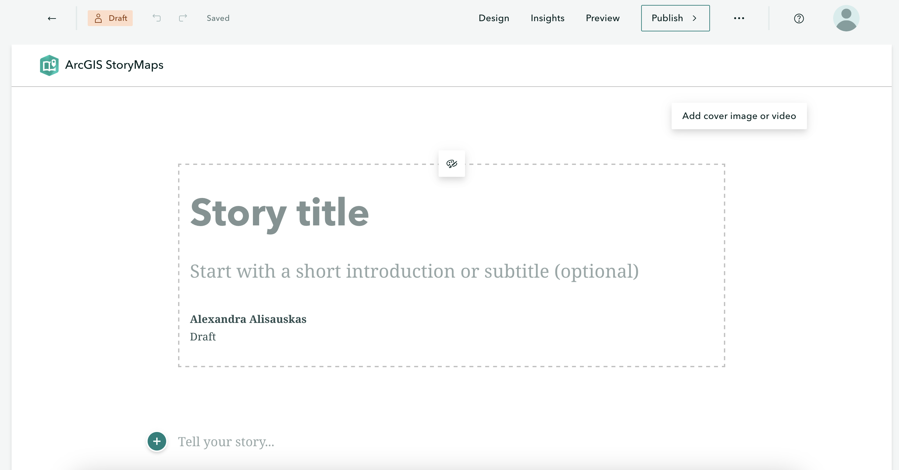

# Create an ArcGIS Online StoryMap
<br>
After creating a free Storymap account, navigate to [storymaps.arcgis.com/stories](https://storymaps.arcgis.com/stories) and **Sign In**. Click **Create story**.
    
<br>


## Exploring the interface 
You will start with a blank Storymap and land on the cover. You'll notice a little paintbrush and palette icon appears, allowing you to center or justify the header block. Feel free to add a subtitle and descriptive text, as well as your name. You can also add a cover image or video. 
<br>




<br>

- On the top upper left-hand corner of the interface, notice your changes have **saved automatically**. The curved forward and backward arrows allow you to **undo** and **redo** your moves as you go. The straight back arrow will take you back to the StoryMaps homepage. Notice also that you're working in ```Draft``` mode. 

- On the upper right-hand corner of the interface, you'll see options to **Preview** and **Publish** your StoryMap. Preview allows you to look at your StoryMap as if you were an outside visitor to the site, while Publish actually makes your work visible online. You can Publish your StoryMap as many times as you want. Previewing your StoryMap will not change what is Published. 

- Who can see your published work? The three dots (ellipses) beside Publish reveal **more actions**. Here you can delete your story all together, duplicate it (if, for instance, you want to make different versions), and manage the **settings**. 

- To see the **full details** of your StoryMap, go back to the StoryMaps homepage and click the three dots beside your StoryMap's tile. Here you can set things like terms of use, attribution, sharing permissions, description, and more. **Change share access to public, ensuring everyone can see your final map.**

- Lastly, **Design** enables you to choose an out-of-the box **Theme** for your StoryMap. You can also adapt your **Cover Layout** Note: only paid AGOL accounts allow you to create your own Themes. However, there is still a variety to choose from. 

<br>
