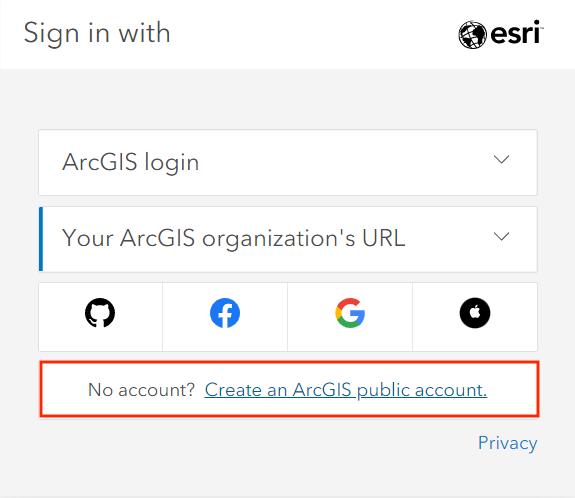
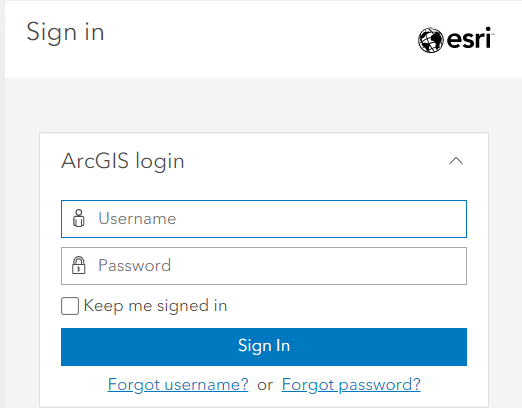

## Collaborating on a StoryMap using a Public (Free) Account
For this class, you will be creating a Public (Free) StoryMap account.

To add collaborators to a StoryMap using a Public (Free) account, you first need to share the content with all of ESRI users then create a group to share. I recommend having one group member create the account and share the login with the group members.

If you do use a single shared login, be aware that if you are working on the StoryMap at the same time, your edits may not save, or they may overwrite someone else's work working simultaneously. All this to say, coordinate with your group members to do work at different times so you don't risk losing any edits.

## Account Setup

*1*{: .circle .circle-purple} Navigate to [https://storymaps.arcgis.com/](https://storymaps.arcgis.com/) and click **Sign In**.

*2*{: .circle .circle-purple} Click **Create an account** at the very bottom. 

*3*{: .circle .circle-purple} Fill in your information.

*4*{: .circle .circle-purple} Sign in.

{: .note}
If you are interested getting a personal ArcGIS account, you can find more information [here](https://gis.ubc.ca/software/). Be mindful that students and departments have different options for licenses. Please contact Geospatial Systems Analyst Haitao Li (ht.li@ubc.ca) if you need help with UBC’s Esri product.

 

## ArcGIS Free vs. Enterprise Account
An ArcGIS free account can be created by anyone and is intended for noncommercial, nongovernmental use. Most features including audio, timlines, and image galleries are now available with the free acount. When using ArcGIS StoryMaps with a public account, some advanced storytelling and customization features are not available, including:

- embedding web pages
- customizing story theme and logo
- Google analytics tracking ID
- Categorized layers

You can still include images and video, embed map tours, and use the swipe tool. You can read more about features on the [ArcGIS Storymap Licensing page](https://doc.arcgis.com/en/arcgis-storymaps/reference/licensing.htm).

