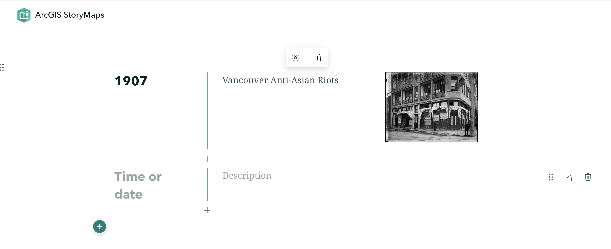

# Adding Content Blocks 
 

A StoryMap is essentially a one-page website made by adding blocks of various content one after another. These blocks are called **content blocks**, and can be added by simply clicking the  waiting below your title.  
 

When you click on , you'll see the different kinds of content that can be added. Notice, however, some options are greyed out when working with a free account. Not to worry — you can still get a lot done with the content blocks available. 

----

## Basic Content Blocks

Basic content blocks include Text, Button, Separator, and Code. 

- **Text** allows you to add and style paragraphs, including hyperlinking text. Once you begin writing, simply highlight the text you want to modify and the styling menu will appear. 

- **Button** allows you to add hyperlinked text styled as a button. Add a word or phrase as appropriate, then click the pencil icon to add a hyperlink. The appearance of button is determined by the StoryMap Theme, and cannot be changed within free account. 

- **Separator** simply adds a plain line to your StoryMap. 

- To **delete** any content block, click out of it and then hover over the block until a trashbin icon appears. You can drag and **rearrange** content blocks as you wish. 

## Data Visualization

- **Map** will take you out of StoryMaps to ArcGIS Online mapping platform. Later in this workshop you will be guided through creating a simple web map to embed in your StoryMap.

- **Chart** will create a column, bar, donut, line chart out of manually imputted data. You cannot upload external spreadsheets, however. 

- **Table** creates a simple table which can be populated with text. 

## Media

You can add **Image**, an **Inage Gallery**, and **Video**. For some multimedia (image, video) you can upload or add a link. For video in particular, it's recommended to link from an external source, like YouTube, since longer videos will rapidly use up your storage.  You can also add or embed **Audio**.

You can create a **Timeline** to clearly show events temporally.

**Swipe** lets readers compare two maps or images with an interactive slider. This can be useful for showing the same location at different moments, or the same map in different styles. You can use Express Map to create a map on the fly.

