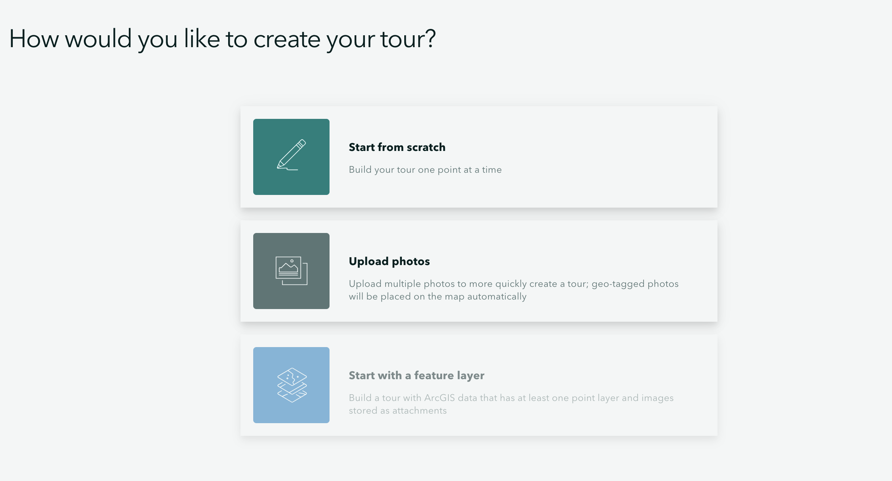
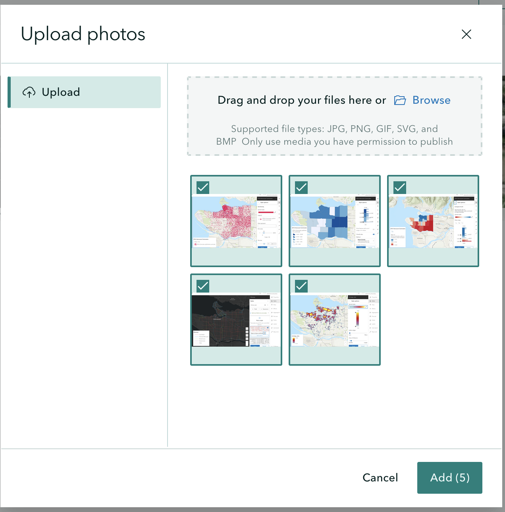
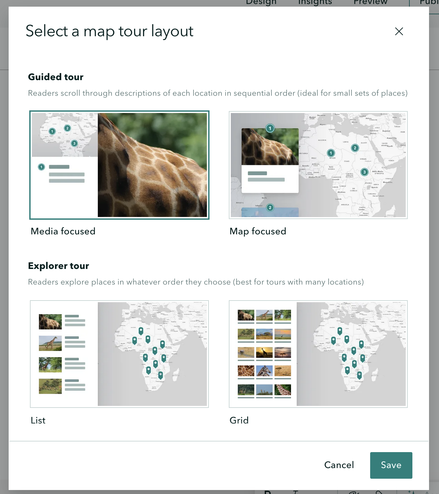
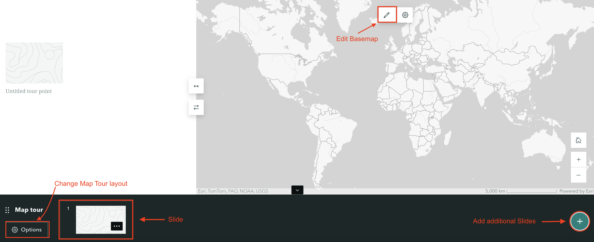
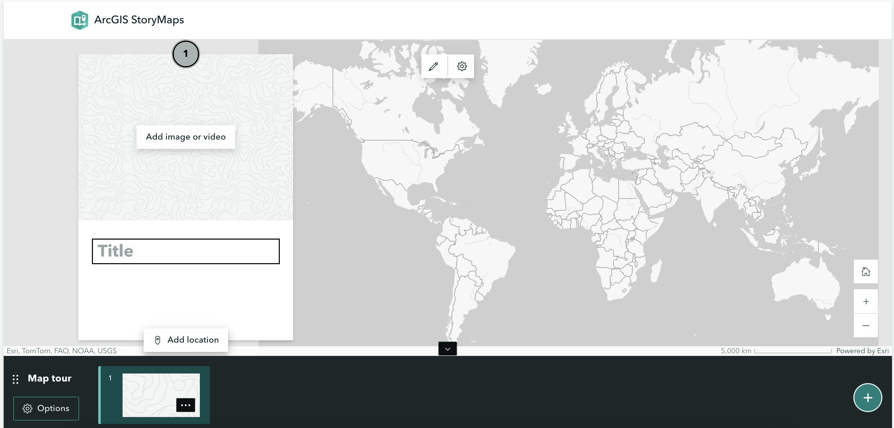
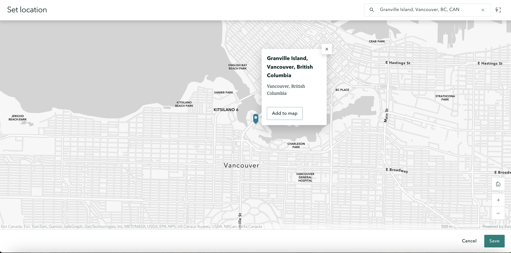

## Guided Map Tours

You can create a map tour to showcase a set of places. You can decide whether your readers get to explore these places in any order, or are led through in an order of your choosing. 

You can add a Guided Map Tour anywhere in your story. You can also include more than one - this might be useful if you want to create maps representing different categories or askpects of your walking tour.

## Add a Guided Map Tours
Click the green plus sign and select Map Tour under the Immersive heading. You can start your Map Tour from scratch or by uploading photos.

If you have a folder of images you want to use in your Map Tour, you can select Upload Photos to batch upload them. Don't worry too much about the order, as you will be prompted to confirm your selection of images and the order they go in. Each image will populate your tour with one point. 

You will be prompted to select a Map Tour type. For your assignment you should select Guided Tour. Guided leads the reader through an order of your choosing, whereas Explorer allows the reader to peruse on their own. 

For Guided Tour, there are two options
- Media Focused which features an image or video in the main right panel
- Map Focused which features a map in the main right panel

When you choose a layout, a new content block will be added to your StoryMap. It will look something like the below. The bottom banner contains the "Slides" of your map. Each slide displays some text and/or multimedia, and is connected to a location on the map. 

## Add a Tour Point
Each slide on your Guided Map Tour is a point consisting of 3 components
- A panel for title and description. 
- A media panel for images or videos of each place
- A map panel to locate that point

To add a new tour point, click the green plus button the bottom right of the Guided Tour Slider. 

### Title and Description

If you click on the slide's title, you can add a title. You can do the same with the description section. As part of the description you can add text, audio or a button. Neither the title nor descriptionfields are required; if you leave the field blank they just won't appear

### Add Media

You can add images or video to your tour stop. You can add images via a link or by uploading a file. Supported file types include JPG, PNG, GIF, SVG, BMP, WEBP, HEIC, HEIF, TIF, TIFF, MP4, MOV, MKV, AVI, and WEBM.

### Add Location and Edit Basemap

To add a location, click on the first Slide and select "Add location". Now, you can either search the location on the top-right, or zoom-in to it. With your cursor as a crosshair, click the location and save. Once you choose a point and click "Add to map", there are two options of zoom level that you can select when you add a location. Using map tour setting will automatically adjust the zoom level so all points are visible simultaneously. Use current zoom level will keep the zoom level always be street or city. You can always go back and edit locations later. 

- To customize the basemap, click the pencil icon. You can select different styles, 2D or 3D, etc.

- You can choose to add progress lines that connect points on your tour. These are not walking directions, but a line 'as the crow flies' that will connect the points directly, so think about how your reader will be using the map. 

### Edit Slides
You can click on the gear icon that says Options to change elemts of your Guided Tour, including layout or style. You can also edit numbering to be ascending or descending, or to start at a particular number. This latter feature can be useful for creating several Guided Tours, but which have continuous numbering.

You can use the Options menu to delete your tour or to duplicate it. 

You can easily change the order of your slides/tour stops by simply clicking and dragging them to the desired order.

